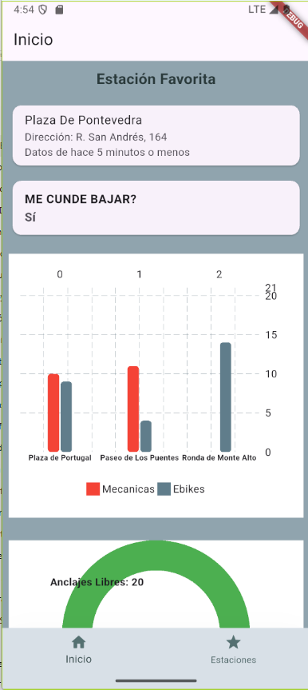
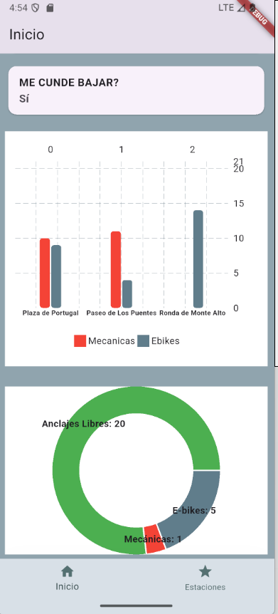
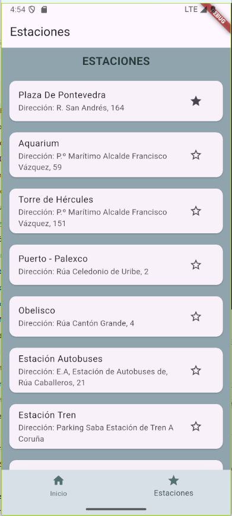
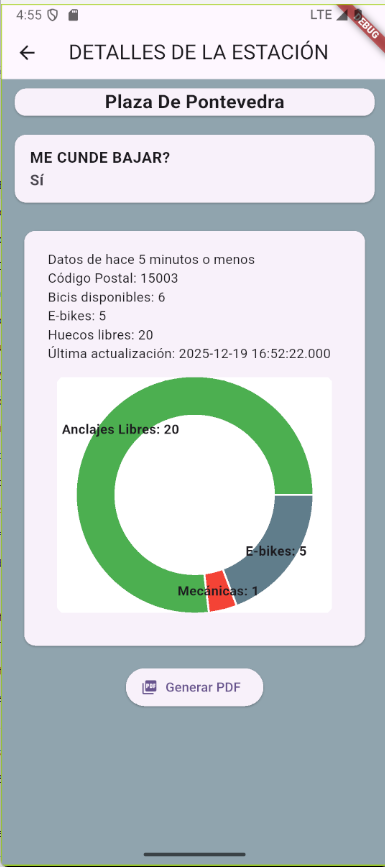
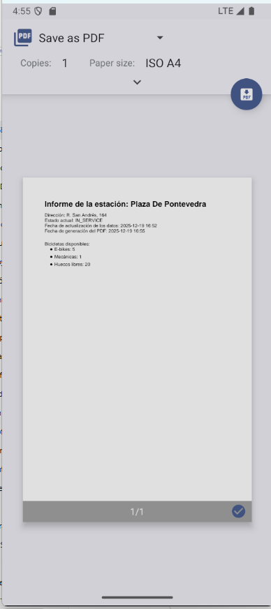

# Bicicorunha

Vista rápidas a la estación que tengas como favorita, pudiendo cambiarla si fuera necesario.

## Gráficas
- Gráfico A: Top 3 estaciones con más bicicletas (barras separadas entre mecánicas y eléctricas)
- Gráfico B: Estado de una estación concreta (pie chart con e-bikes, mecánicas y huecos)
 
## Capturas

Inicio con la esatación favorita

Gráficas de la estación favorita

Lista de estaciones

Detalles de una esatción

Vista PDF 

## Dependencias

- http 
- fl_chart
- pdf
- printing
- intl